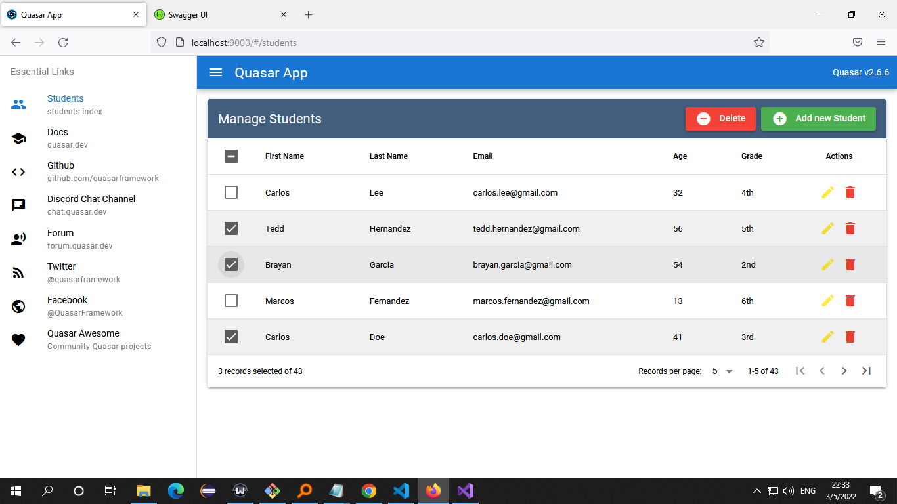

# Quasar App (hello-world-quasar)

A Quasar Project implementing a crud without modals view

## Install the dependencies
```bash
yarn
# or
npm install
```

### Start the app in development mode (hot-code reloading, error reporting, etc.)
npx quasar dev
```bash
quasar dev
```


### Build the app for production
```bash
quasar build
```

### A view


### Customize the configuration
See [Configuring quasar.config.js](https://v2.quasar.dev/quasar-cli-vite/quasar-config-js).
